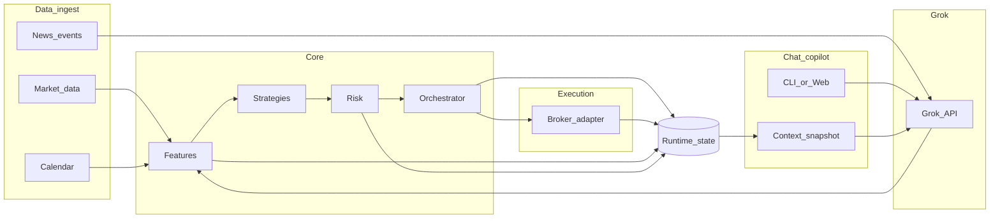

# תוכנית: מערכת מסחר אוטונומית (שוק ארה"ב)

## מציאות חשובה לגבי Colmex Pro

- **אין בתיעוד הציבורי של Colmex Pro (כולל ה-[FAQ](https://www.colmexpro.com/faq/)) ממשק מפתחים (REST/FIX) ברור למסחר אוטומטי מלא** כמו ב-Alpaca או ב-Interactive Brokers. יש דגש על פלטפורמת Colmex Pro 2.0 ואינטגרציה עם **TradingView** (לפי סוג חשבון ומדינה) — זה **לא** אותו דבר כמו בוט שרץ 24/7 ושולח הוראות מהקוד שלך.
- **לפני כל אוטומציה בפלטפורמה שלהם**: חובה לשאול את התמיכה/הציות של Colmex האם קיים API מאושר, או האם סוג מסוים של אוטומציה מותר בתנאי השימוש. ביצוע ללא אישור עלול לסכן חשבון.

**מסקנה לתכנון:** בונים את המערכת כך ש**שכבת הביצוע** (הזמנות) היא נתלית בברוקר, ומתחילים עם ברוקר שיש לו **API מתועד**; אם Colmex יאשרו ממשק — מוסיפים מתאם (`adapter`) ייעודי.

## ברירת מחדל מומלצת vs בחירה בתוכנה

**בתוכנה** תהיה **רשימת מצבים מלאה** (קובץ קונפיג / פרופיל + אופציונלית CLI), כך שתוכל לעבור ביניהם בלי לשנות קוד. להלן **הפרופיל המומלץ בהפעלה ראשונה** (`paper_safe`), והאפשרויות שיופיעו לבחירה.

### פרופיל מומלץ בהתחלה (`paper_safe`)

1. **ברוקר**: `ibkr` + **Paper**.
2. `**dry_run`**: אפשר `true` בימים הראשונים — רישום הוראות בלוג בלי שליחה לברוקר.
3. **Grok**: `news_only` (חדשות בלבד).
4. **אסטרטגיה**: כללים קוונטיטטיביים בלבד; ללא `grok_order_proposals` עד שאתה מפעיל במפורש.

### כל האפשרויות שיוגדרו בקונפיג (לבחירתך בתוכנה)

| מפתח / קבוצה            | ערכים אפשריים                                                                                  | הערה                                                                                 |
| ----------------------- | ---------------------------------------------------------------------------------------------- | ------------------------------------------------------------------------------------ |
| `broker`                | `ibkr` (ברירת מחדל מימוש), `alpaca` (כשקיים מתאם)                                              | בחירה קובעת איזה `BrokerClient` נטען                                                 |
| `account_mode`          | `paper`, `live`                                                                                | `live` דורש אישור מפורש בקונפיג (מניעת טעות)                                         |
| `execution.dry_run`     | `true`, `false`                                                                                | `true` = אין שליחת הוראות, רק לוג והתראות                                            |
| `grok.enabled`          | `true`, `false`                                                                                | `false` = ללא קריאות xAI                                                             |
| `grok.role`             | `off`, `news_only`, `order_proposals`                                                          | `news_only` = תיוג/סנטימנט; `order_proposals` = JSON הצעות עסקה                      |
| `grok.orders.approval`  | `manual`, `auto_within_risk`                                                                   | `manual` = התראה + אישור לפני IBKR; `auto` רק אחרי ניסוי ארוך ב-paper ובתקרות קשיחות |
| `strategy.mode`         | `rules`, `rules_with_news_filter`, `merge_grok_proposals`                                      | איך משלבים סיגנלים עם חדשות/הצעות Grok                                               |
| `signals.colmex`        | `off`, `notify_only`                                                                           | בלי API — רק התראות לביצוע ידני ב-Colmex                                             |
| `notifications.channel` | `none`, `telegram`, `email` (רשימה ניתנת להרחבה)                                               | לאישורים והתראות                                                                     |
| `risk`                  | תקרות נפרדות (יומי, לעסקה, מספר עסקאות, רשימת סימבולים מותרים)                                 | תמיד פעיל; לא ניתן לכבות ב-live ללא אזהרה                                            |
| `grok.chat.enabled`     | `true`, `false`                                                                                | צ'אט Copilot; עצמאי מ־`grok.role` (אפשר חדשות אוטומטית + צ'אט, או רק צ'אט)           |
| `grok.chat.ui`          | `cli`, `web` (שלב 2)                                                                           | CLI מיד; Web אופציונלי (למשל FastAPI + עמוד צ'אט פשוט)                               |
| `grok.chat.context`     | רשימת מודולים: `profile`, `positions`, `orders`, `signals`, `news_digest`, `risk`, `logs_tail` | מה נכנס ל־ContextSnapshot בכל הודעה; ניתן לצמצם לפרטיות/עלות                         |

**כללים**: טעינת קונפיג עם **סכימה/ולידציה** (ערכים שלא קיימים ברשימה → שגיאה בהפעלה). שינוי ל־`live` או ל־`grok.orders.approval=auto_within_risk` ידרוש דגל/אישור מפורש (למשל `I_ACCEPT_LIVE_RISK=true`) כדי למנוע הפעלה בטעות.

**דורש ממך בפועל (חד-פעמי ל-IBKR)**: **TWS** או **IB Gateway**, API מופעל, חשבון Paper — כש־`broker=ibkr`.

## מה "מערכת שעושה הכל" באמת כוללת (רכיבים)

1. **נתוני שוק**: ברים/טיק (לפי תקציב), מחירים, נפח, מדדים (למשל דרך ספק כמו Polygon / provider של הברוקר / Yahoo לצורך מחקר בלבד).
2. **חדשות ואירועים**: הזנות RSS, APIs חדשות (למשל Finnhub/Benzinga לפי מנוי), סינון רעש, זיהוי טיקרים. **Grok** משמש כאן לסיכום קצר, חילוץ ישויות (טיקרים), סיווג סוג אירוע (earnings, guidance, רגולציה) וסנטימנט **בפלט מובנה** — לא כ"מחולל הוראות" עצמאי.
3. **אסטרטגיות**: התחלה מכללים פשוטים (מומנטום, ממוצע נע, פריצה) + backtest; רק אחרי בדיקות — מעבר ל-live או paper.
4. **ניהול סיכון (חובה לפני כסף אמיתי)**: גודל פוזיציה מקסימלי, מקסימום הפסד יומי, kill switch, מגבלות ליווי (concurrency), ולוג מלא לכל החלטה.
5. **ביצוע**: שליחת הוראות, מעקב סטטוס, טיפול בשגיאות, idempotency (לא לכפול הזמנות אחרי ריסטארט).
6. **תצפית ואבטחה**: לוגים, התראות (מייל/Telegram), אחסון סודות בצורה בטוחה (לא בקוד).

## נתיב ברוקר (נבחר בקונפיג)

| `account_mode` | `broker` | הערה                                                               |
| -------------- | -------- | ------------------------------------------------------------------ |
| `paper`        | `ibkr`   | מומלץ לפיתוח; TWS/Gateway                                          |
| `live`         | `ibkr`   | רק אחרי בדיקות + kill switch + תקרות                               |
| `paper`        | `alpaca` | אופציונלי כשמתאם Alpaca קיים                                       |
| —              | Colmex   | אין ביצוע אוטומטי עד `adapter`; עד אז `signals.colmex=notify_only` |

## אינטגרציית Grok API (xAI)

### מצב א׳ (ברירת מחדל, הכי יציב): חדשות בלבד

- פלט JSON קבוע: `tickers`, `sentiment`, `event_type`, `confidence`, `summary`.
- האסטרטגיה הקוונטיטטיבית + הריסק קובעים אם לבצע — לא ה־LLM לבד.

### מצב ב׳ (אופציונלי): "Grok מסחור" — בעצם **הצעות פקודה**, לא שליטה גולמית בברוקר

אם אתה רוצה ש־Grok "יסחור", בתוכנית זו המשמעות היא: **המודל מחזיר הצעת פקודה מובנית**, וה**קוד** מחליט אם לשלוח ל־IBKR.

- **פורמט חובה** לדוגמה: `action` (buy/sell/hold), `symbol`, `qty` או `notional_max`, `time_in_force`, `reason_short`, `confidence`. כל שדה עובר **ולידציה** (סימבול ברשימה לבנה, כמות ≤ תקרה, רק שעות מסחר, אין short אם חסום, וכו').
- **שכבת סיכון לפני IBKR**: מקסימום עסקאות ליום, מקסימום הפסד יומי, גודל פוזיציה, מניעת כפילויות, דה־דופליקציה מול הוראות פתוחות.
- **Paper חובה** לתקופת בדיקה ארוכה; **Live** רק עם אחד מהבאים: (א) **אישור ידני** (התראה — אתה מאשר בלחיצה), או (ב) **מגבלות קשיחות** מאוד (הון זעום, מעט סימבולים, תקרות נמוכות).
- **סיכונים שעדיין קיימים**: הזיות, עיכוב, עלות API, שינוי משמעות של פרומפט — לכן **אסור** לתת ל־Grok לפתוח socket ישירות לברוקר או לעקוף את מודול הריסק.

**טכני משותף למצבים**: מפתח ב־`GROK_API_KEY`, retries + backoff, מכסות, לוג מלא של prompt/response. כשל סכימה → **אין ביצוע**.

**פרטיות**: בפרומפט — רק נתונים ציבוריים (חדשות, מחירים עיכוביים/סיכום), לא מזהי חשבון או יתרות; גודל פוזיציה נגזר בקוד מהריסק, לא "שאל את Grok כמה כסף יש לי".

### מצב ג׳: צ'אט Copilot עם Grok (בכל מצב תפעול)

מטרה: שתוכל **לדבר עם Grok בזמן אמת** והוא רואה **את אותו מצב** שהמערכת רואה — בלי שיצ'אט יהפוך ל"שליטה ישירה" על החשבון.

- **מקור אמת משותף**: אובייקט/מסד `Runtime_state` (או קובץ snapshot מחזורי) שמזין גם את ה־runner וגם את בונה ההקשר לצ'אט — פוזיציות מסוכמות, הוראות פתוחות, סיגנלים אחרונים, תוצאות Grok על חדשות (אם הופעל), מונה הפסד יומי, דגל kill switch, הפרופיל הפעיל (`paper`/`live`, `dry_run`), ושגיאות אחרונות.
- **ContextSnapshot לפני כל הודעת משתמש**: JSON או טקסט מובנה שנבנה לפי `grok.chat.context` (ניתן להרחבה). ברירת מחדל מומלצת: פרופיל + ריסק + פוזיציות + סיגנלים + תקציר חדשות (לא מאמרים מלאים) + זנב לוג קצר.
- **מה לא נכנס לפרומפט**: מפתחות API, סיסמאות, מספרי חשבון מלאים, טוקנים; רק סיכומים מספריים/סטטוס.
- **התנהגות הצ'אט**: תשובות **הסבר/ניתוח/המלצות כלליות**; אם המשתמש מבקש "תבצע", המערכת יכולה להציע **טיוטת `OrderProposal`** שעוברת **את אותם שערים** כמו במצב ב׳ (ולידציה + ריסק + אישור לפי הקונפיג) — **לא** שליחה ישירה מ-Grok.
- **ממשק**: שלב 1 — **CLI** (`python -m app chat` או פקודה דומה); שלב 2 אופציונלי — **Web** מקומי (למשל FastAPI + עמוד צ'אט) אם תרצה חוויית דפדפן.
- **עלות וביצועים**: הגבלת אורך snapshot, רענון לפי צורך (לא לשלוח היסטוריית שוק שלמה בכל הודעה); אפשר מכסת הודעות לדקה.

## מבנה פרויקט מומלץ (מודולרי)

- `config/` — קבצי פרופיל (למשל `config/profiles/*.yaml`), סכימת ולידציה, ברירת מחדל `paper_safe`; משתני סביבה רק לסודות (API keys).
- `data/` — הורדת נתונים, אחסון מקומי (למשל SQLite/Parquet).
- `news/` — סורק חדשות, נרמול, התאמה לטיקרים.
- `llm/` — לקוח Grok, תבניות פרומפט, פארסר JSON; תת־מודול `llm/chat.py` (לולאת צ'אט + בניית ContextSnapshot); תת־מודול לחדשות.
- `state/` (או `runtime/`) — `Runtime_state` חי/מוקפץ, נקרא על ידי runner וצ'אט.
- `strategies/` — ממשק אחיד: `generate_signals(state) -> orders_intent`.
- `risk/` — ולידציה של כוונות לפני ביצוע.
- `brokers/` — `BrokerClient` אבסטרקטי; **יישום ראשון: IBKR** (למשל `ib_insync` מול TWS/Gateway); Alpaca אופציונלי; בעתיד `colmex` אם יתאפשר.
- `runner/` — לולאת אירועים (cron / streaming), ניטור.
- `tests/` — בדיקות יחידה לריסק ולוגיקה; backtests נפרדים.

שפת מימוש נפוצה: **Python** (מערכת אקולוגית עשירה לנתונים ומסחר); חלופה: Node.js אם יש העדפה.

## שלבי יישום (מומלץ — לא "הכל בבת אחת")

1. **שלב 0 — הגדרות וסיכון**: מגבלות, מצב paper בלבד, לוג מלא.
2. **שלב 1 — נתונים + backtest**: אסטרטגיה אחת פשוטה, מדדי ביצועים (Sharpe, drawdown, hit rate).
3. **שלב 2 — חדשות + Grok כשכבת סינון**: חיבור הזנות חדשות; Grok מחזיר מבנה קבוע; כללי בטיחות קודיים (למשל חסימה סביב earnings, סף confidence, רשימת מקורות מאושרים).

3bis. **שלב 2bis — צ'אט Copilot**: `Runtime_state` + ContextSnapshot + CLI צ'אט; Grok מקבל הקשר מלא מותאם קונפיג; ללא ביצוע ישיר.
4. **שלב 3 — ביצוע paper**: חיבור ל-**IBKR Paper** (TWS/Gateway פתוח, API מופעל), הרצה בשעות שוק בלבד, ניטור שגיאות והוראות כפולות.
5. **שלב 4 — live (רק אחרי יציבות)**: הפעלה הדרגתית עם הון קטן, kill switch, ועצירה אוטומטית בעת חריגה מתקציב הפסד.

## רגולציה, מס ואחריות

- זה **לא ייעוץ השקעות**. יש לבדוק מול רואה חשבון/עורך דין בישראל היבטי מס והגבלות על מסחר באמצעות ברוקר זר.
- ודא שאתה מסכים לתנאי הברוקר ולכללים נגד מניפולציה / שימוש לרעה ב-API.

## מה נדרש ממך כדי להתחיל מימוש (אחרי אישור התוכנית)

- **IBKR**: חשבון + **Paper**; התקנת **TWS** או **IB Gateway**; הפעלת **API** (פורט מוגדר, אישור לחיבורים מקומיים); מפתחות/סיסמה לפי מדיניות IBKR (לא בשורת קוד).
- **אופציונלי**: מייל ל-Colmex על API מאושר — לא חוסם את הפיתוח על IBKR.
- **הרצה**: מקומית לפיתוח; **VPS** ל-production כשמחברים live (המלצה).

